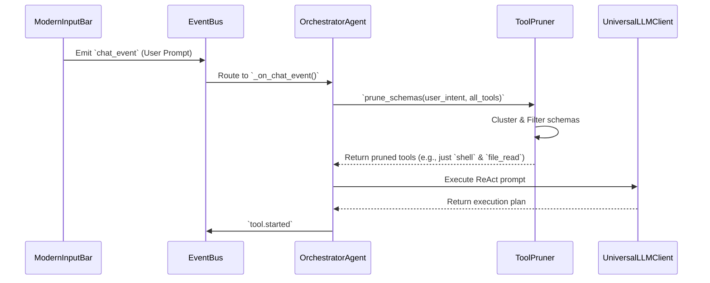
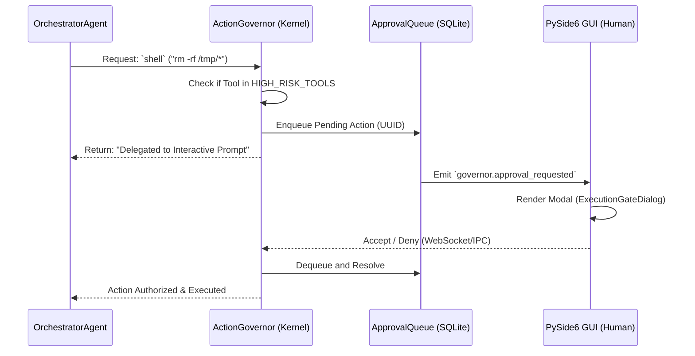
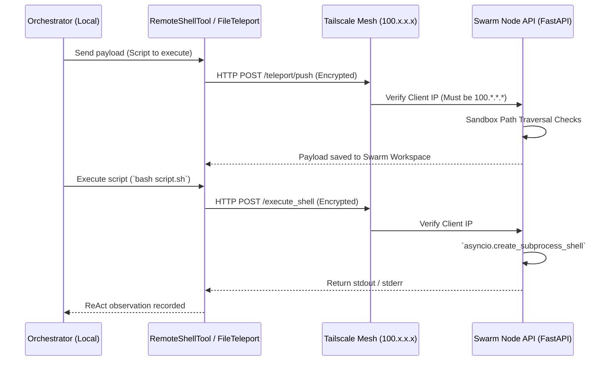

# AXIOM V11 Architecture Specification

AXIOM is a highly decoupled, modular AI operating system. The architecture isolates the synchronous PySide6 GUI thread from the heavy asynchronous processing tasks performed by the headless daemon and orchestrated LLM agents.

## 1. Subsystem Map

* **GUI Layer (`axiom/gui`)**: Thin PySide6 client running entirely synchronously. The `ThemeManager` applies dynamic declarative CSS natively, and `AxiomGuiBridge` sends/receives events via IPC without ever blocking the Qt main loop.
* **Kernel & EventBus (`axiom/core`)**: The synchronous central nervous system. Uses publish-subscribe semantics (`event_bus.publish`) to route telemetry, LLM tokens, system anomalies, and tool execution requests between isolated components.
* **Orchestration Layer (`axiom/agents`)**: The ReAct execution environment where `OrchestratorAgent` invokes dynamically pruned tools, consults the memory graph, and interfaces with `SmartRouter` to invoke models via `LiteLLM`/`Ollama`.
* **Memory Subsystem (`axiom/memory`)**: A unified SQLite Semantic Vector Memory + Qdrant Vector Store layer. Features temporal decay and background `DeepMemoryConsolidation` that triggers autonomously during system idle to optimize the WAL.
* **Perception Kernel (`axiom/perception`)**: Background asynchronous daemons (e.g., `SystemHealthWatchdog`) that continuously poll host OS resources (RAM, disk, `journalctl`) and dispatch proactive notifications or trigger REM sleep cycles.
* **Swarm Execution (`axiom/server`)**: A FastAPI-powered `Node API` allowing remote execution, heavily guarded by an implicit Tailscale `100.x.x.x` Trust Boundary.

---

## 2. ReAct Observation Pipeline & Tool Pruning

When a user inputs a query, it flows through a secure pipeline to limit token bloat and TTFT (Time-To-First-Token). The `ToolPruner` evaluates intent to strip unneeded tools, and the `ObservationCompressor` shrinks huge payloads.

---

## 3. Action Governor / Async Approval Flow

The `ActionGovernor` sits between the ReAct planner and the system kernel. For high-risk actions (like `rm -rf`, or heavy file writing), execution is paused, queued in a dedicated SQLite `ApprovalQueue`, and delegated to the human user asynchronously.

---

## 4. Deep Memory Consolidation (REM Sleep)

To prevent "Context Rot" and SQLite bloat during 24/7 operation, the `SystemHealthWatchdog` triggers `DeepMemoryConsolidation` during off-peak idle hours (e.g., 3:00 AM).

* **Temporal Decay:** Ephemeral agent logs older than 30 days have their decay score reduced to absolute zero and are pruned.
* **Semantic Fusion:** The daemon generates hashes of all text nodes. If duplicate strings (e.g., "Dependency failure" and "dependency failure") exist, they are fused into a single dense node, deduplicating the semantic vector footprint.
* **Yield Guards:** The daemon runs inside a tight `asyncio` loop, yielding every 10 iterations (`await asyncio.sleep(0.01)`) to ensure it never locks the SQLite WAL while the PySide6 UI remains active.

---

## 5. Swarm Tailscale Node Execution & File Teleportation

The Swarm protocol enables local LLMs to manage remote machines over an encrypted mesh. The execution endpoints mandate exact Tailscale IP subsets.

---

## 6. Sandboxing & Execution Boundaries (Bubblewrap)

To protect the host operating system from rogue shell commands and untrusted tool executions, AXIOM implements a strict containment boundary utilizing **Bubblewrap (bwrap)**.

* **Capability Detection:** The `SandboxRunner` abstraction verifies the presence of `bwrap`. If absent, AXIOM intentionally falls back to native execution but broadcasts a `DEGRADED_SECURITY` alert to the EventBus.
* **Isolation Mechanics:** When `bwrap` is active, the Orchestrator executes payloads inside an isolated namespace. The host filesystem is mounted as entirely read-only (`--ro-bind / /`), network access can be disabled dynamically (`--unshare-net`), and the system provisions an ephemeral read-write workspace (`/tmp/axiom_sandbox`) bound locally for the payload to operate within.

---

## 7. Desktop & OS Control Abstraction

AXIOM utilizes a capability-aware abstraction layer to manage global OS interactions (mouse, keyboard, and window management), ensuring graceful degradation when specific compositors limit programmatic input.

* **Capability Verification:** The `get_os_controller()` factory detects the environment (`$XDG_SESSION_TYPE`, `$XDG_CURRENT_DESKTOP`) and provides a tailored `BaseOSController` implementation. Instead of blindly executing commands, tools inspect boolean capabilities (e.g., `can_click`, `can_type`) prior to execution.
* **Graceful Degradation:** On unsupported environments (e.g., standard GNOME Wayland), the system yields an `UnsupportedController` which proactively intercepts and communicates the environment limitations to the orchestrator, preventing unhandled runtime exceptions.
* **Wayland vs. X11:** *Mouse and Keyboard automation currently requires X11 or a wlroots-based Wayland compositor (like Hyprland).* 

---

## 8. OTA Reliability & Rollbacks

AXIOM implements a highly secure, self-healing Over-The-Air (OTA) update pipeline to prevent broken releases from bricking the user's OS integration.

* **Cryptographic Verification:** When the `UpdateManager` fetches a new binary payload, it simultaneously retrieves the `sha256sum.txt` artifact from the GitHub Release. The downloaded payload (`AXIOM.tar.gz`) is cryptographically verified against the signed hash before any extraction or execution occurs. Mismatches trigger an immediate `VerificationError` and payload deletion, preventing Man-in-the-Middle (MitM) attacks or execution of corrupted downloads.
* **Health-Check Swap Script:** The `swap_axiom.sh` generated during update executes a multi-stage atomic swap. It backs up the existing installation to `AXIOM.bak`, moves the new binary into place, and performs a dry-run execution with the `--health-check` flag. 
* **Self-Healing Rollbacks:** If the `--health-check` boot fails (non-zero exit code due to missing dependencies, corrupt compilation, or environment crashes), the swap script intercepts the failure, automatically restores the `.bak` directory, and relaunches the previous working version seamlessly.

---

## 9. Packaging & Distribution (AppImage)

AXIOM utilizes a heavily optimized PyInstaller pipeline to distribute the application as a single, portable AppImage for Linux environments.

* **Binary Size Optimization:** To prevent extreme bundle bloat, `AXIOM.spec` implements an aggressive pruning protocol. It categorically excludes `tkinter`, data-science modules (`matplotlib`, `jupyter`, `IPython`, `scipy`, `pandas`), and massive unneeded `PySide6` submodules (`QtWebEngine`, `QtQml`, `Qt3D`, `QtQuick`). This guarantees the final `.AppImage` is remarkably lean.
* **Smart AppRun Wrapper:** The generated `.AppImage` does not execute the payload blindly. It utilizes a custom `AppRun` Bash wrapper that inspects the host operating system dynamically via `/sbin/ldconfig` prior to booting.
* **Host Dependency Safety:** The `AppRun` wrapper strictly verifies the existence of PySide6 platform requisites (`libxcb.so.1` for X11/Wayland plugin and `libGL.so.1`). If missing, it halts execution and utilizes `zenity`, `kdialog`, or standard terminal output to provide the user with clear instructions for installing the missing dependencies via their system's package manager, preventing silent PySide6 core dumps.
* **Model Asset Preservation:** PyInstaller hooks explicitly leverage `collect_all` for `faster_whisper` and `openwakeword` to ensure their dynamic C-libraries and hidden assets are preserved inside the payload.

---

## 10. Hardware Telemetry Agnosticism

AXIOM's `TelemetryService` is designed to be completely hardware agnostic. It does not enforce a monoculture or hardcode binary calls that crash non-compliant environments.

* **Capability Probing:** On boot, the service utilizes `shutil.which` to dynamically probe for `nvidia-smi` (Nvidia Discrete) and `rocm-smi` (AMD ROCm).
* **Graceful Fallbacks:** If neither telemetry binary is found, it automatically detects an `Integrated / CPU-Only` state. It suppresses VRAM polling and securely returns zeroed values rather than spamming the internal logger with exceptions.
* **Driver Resiliency:** All subprocess calls to GPU pollers are wrapped in strict `1.0s` timeouts and protected `try/except` blocks. If a GPU driver hangs (e.g., due to D3cold power states or kernel bugs), the telemetry thread catches the `TimeoutExpired` exception, logs a controlled warning, and preserves the heartbeat of the rest of the application.
