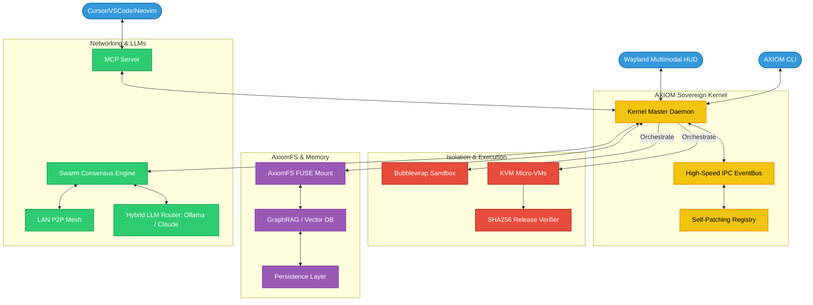
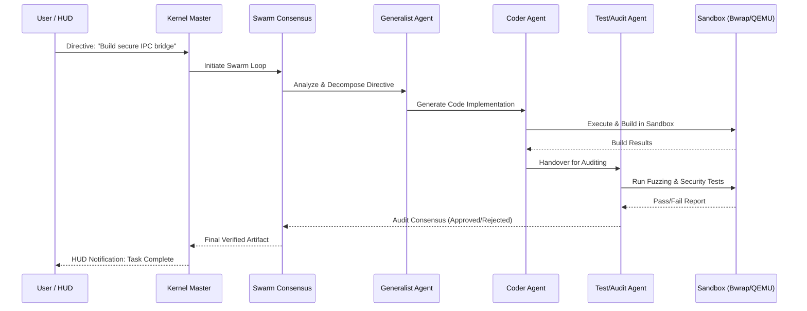

# AXIOM System Architecture

## Overview

AXIOM v5.3.0 is structured as a **Sovereign AI Operating System Layer**. It moves beyond the "AI application" paradigm into a persistent system service that manages hardware, filesystems, and network nodes as first-class citizens in an autonomous reasoning loop.

---

## 🗺️ System Architecture Diagram

---

## 🔧 Subsystem Deep-Dives

### 1. **Sovereign Kernel & Self-Patcher** (`axiom.kernel`)
The Kernel is a persistent `systemd` or `launchd` service that acts as the supervisor for all other components. It maintains an atomic component registry. The **Self-Patcher** allows the kernel to download, verify, and "hot-swap" its own Python modules without losing state, enabling live evolution of agent logic.

### 2. **Hardware Isolation: Bwrap & QEMU** (`axiom.security`)
To prevent "hallucination-driven system damage," all tool execution is sandboxed:
- **Bubblewrap (`bwrap`)**: Rootless, unprivileged containers for standard file/shell operations.
- **QEMU/KVM**: Fully isolated micro-VMs for high-risk operations or complex software builds, featuring snapshotting and state-rollback.

### 3. **AxiomFS: Semantic Filesystem** (`axiom.fs`)
AxiomFS mounts your agent's long-term memory as a standard Linux directory. 
- `/mnt/axiom/memories/` - Dynamic folders based on GraphRAG clusters.
- `/mnt/axiom/scratch/` - Volatile memory for active task reasoning.
- `/mnt/axiom/vault/` - Encrypted long-term secrets.

### 4. **Swarm Consensus Engine** (`axiom.swarm`)
When complex tasks are initiated, AXIOM triggers a **Swarm Loop**:
1. **Delegation**: The task is broadcasted to the local P2P Mesh.
2. **Specialization**: Nodes (local or LAN) bid based on their capabilities (e.g., "Node A has an H100 for heavy lifting," "Node B has local file access").
3. **Reasoning**: Multiple agents generate candidate solutions.
4. **Consensus**: A majority-vote or "Judicial Agent" validates the plan before execution in a sandbox.

### 5. **Multimodal HUD** (`axiom.gui`)
A floating Wayland overlay built with PySide6. It provides:
- **Low-Latency Voice**: GPU-accelerated STT (Whisper) for hands-free control.
- **Ambient Awareness**: Visual indicators of kernel health, memory usage, and swarm activity.
- **Direct Interaction**: Context-aware tooltips that appear over other windows via Wayland protocol extensions.

---

## 🔄 Autonomous Swarm Consensus Lifecycle

The following sequence diagram outlines how the Swarm resolves a high-complexity directive (e.g., "Implement a new feature and verify its security").

---

## 🚀 Future Roadmap: v6.0 and Beyond
- **Hardware Brain-Bridge**: Direct kernel modules for FPGA-accelerated inference.
- **Global Mesh**: Encrypted WireGuard-based federation across public networks.
- **Neural IPC**: Binary event stream optimization for zero-copy memory sharing between local nodes.
