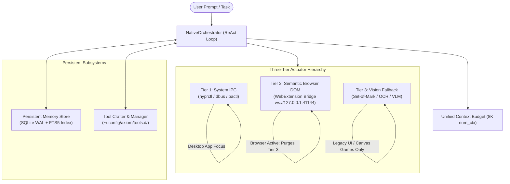

# AXIOM

[](https://github.com/Rutytoi220/Axiom)
[](https://www.python.org/)
[](LICENSE)
[](https://ollama.com/)

**AXIOM** is a local-first autonomous AI orchestration engine built for Linux (specifically Wayland compositors such as Hyprland). It connects local reasoning models to physical desktop workflows through structured system IPC, semantic web DOM automation, persistent memory, and hot-reloadable dynamic tool crafting.

Designed to operate on consumer hardware (e.g., RTX 4060 8GB VRAM) with zero external cloud dependencies, AXIOM executes inference entirely against local endpoints (`http://127.0.0.1:11434`) with zero cloud telemetry.

---

## 1. Core Architecture & Subsystems



### A. Three-Tier Actuator Hierarchy & Negative Gating
Physical workstation control is partitioned into three deterministic tiers with explicit precedence rules to avoid destructive or hallucinated UI actions:

1. **Tier 1: Deterministic System IPC (Highest Precedence)**
   - Interacts directly with Linux subsystems via native IPC (`hyprctl`, `dbus`, `pactl`, `systemd`).
   - Tools: `manage_desktop_window`, `manage_system_process`, `manage_workspace_file`, `query_system_journal`, `manage_media_playback`, `send_desktop_notification`.
   - Returns structured JSON; zero visual hallucination risk.

2. **Tier 2: Semantic Browser DOM Bridge**
   - Interacts with active web pages through an authenticated local WebSocket server (`ws://127.0.0.1:41144`) connected to the AXIOM WebExtension.
   - Tools: `interact_with_browser` (query DOM trees, click CSS selectors, type text, navigate tabs).
   - **Negative Gating & Tier Pruning:** When a browser window is focused and the DOM bridge is active, `NativeOrchestrator` strictly purges Tier 3 generic desktop vision tools (`interact_with_ui`, `capture_desktop_vision`) from the LLM tool manifest. This prevents models from guessing pixel coordinates on interactive web pages.

3. **Tier 3: Visual Grounding Fallback (Lowest Precedence)**
   - Set-of-Mark (SoM) bounding box detection, OCR, and vision-language model (VLM) grounding.
   - Reserved strictly as a fallback for non-DOM applications (legacy X11/Qt widgets, canvas games, remote desktops) where no IPC or DOM introspection exists.

---

### B. Persistent Memory Store (SQLite WAL + FTS5)
Persistent memory is implemented via [`axiom/db/memory.py`](file:///home/rutytoi/Documents/ChienGPT/axiom/db/memory.py):
- **Concurrency & Resilience:** SQLite configured with Write-Ahead Logging (`PRAGMA journal_mode=WAL`), high busy timeouts (`PRAGMA busy_timeout=5000`), and foreign key enforcement.
- **Full-Text Retrieval:** Virtual FTS5 tables (`memories_fts`) with triggers automatically index stored facts.
- **Categorization & Versioning:** Enforces strict categories (`preference`, `environment`, `homelab`, `workflow`, `capability`). Superseded facts track historical lineage without data loss.
- **Session Fact Promotion:** Automatically hydrates relevant memories into initial conversational context and records structured facts across reboots.

---

### C. Autonomous Dynamic Tool Crafting & Lifecycle Management
AXIOM synthesizes, validates, and installs new tools at runtime into `~/.config/axiom/tools.d/` via [`axiom/tools/tool_crafter.py`](file:///home/rutytoi/Documents/ChienGPT/axiom/tools/tool_crafter.py) and [`axiom/tools/tool_manager.py`](file:///home/rutytoi/Documents/ChienGPT/axiom/tools/tool_manager.py):
- **AST Contract Inspection:** Statically parses candidate code with Python's `ast` module to confirm valid syntax, required `async def execute` definitions, and standard schema exports (`TOOL_SCHEMA`, `REQUIRED_RING`, `TIER`, `TUI_HINT`).
- **Privilege Escalation Protection:** Generated dynamic tools cannot claim `REQUIRED_RING = 0` (Ring 0 is immutable and reserved for built-in actuators).
- **Isolated Staging Dry-Run:** Stages the code into `/tmp/axiom_stage_<uuid>.py`, dynamically imports it via `importlib.util.spec_from_file_location`, tests execution under a 5.0s timeout, and cleans up `sys.modules` and scratch files.
- **Atomic Rollback:** If plugin reloading fails, the file is unlinked, the runtime schema is unregistered, and persistent memory is restored to the previous working version.

---

### D. Benchmark & Evaluation Harness (`axiom.eval`)
AXIOM includes a deterministic and live benchmark evaluation suite via [`axiom/eval/`](file:///home/rutytoi/Documents/ChienGPT/axiom/eval/):
- **Level 1 (Deterministic Offline):** 6 self-contained tasks evaluating tool dispatch, recovery envelopes, step limits, false success rejection, memory roundtrips, and timeouts in under 3 seconds with zero GPU or network dependencies.
- **Level 2 (Live Model Evaluation):** Exercises real multi-turn ReAct loops against local models (`qwen3:8b`, `qwen3:1.7b`) with independent disk and state validators.
- **Level 3 (Complex Workflows):** Tests multi-step triage, tool self-repair, and containment.
- **Anti-Hallucination Outcome Verification:** Rejects verbal conversational claims if real observable side-effects (e.g. disk artifacts) were not produced, tagging them as `FALSE_SUCCESS`.
- **Measured Token Telemetry:** Distinguishes measured prompt and evaluation tokens reported by the Ollama stream from character-based estimations.

---

## 2. Benchmark Baseline Highlights (RTX 4060 8GB VRAM)

Empirical results from [`docs/benchmarks/live_baseline_report.md`](file:///home/rutytoi/Documents/ChienGPT/docs/benchmarks/live_baseline_report.md) executed on consumer hardware (Linux Fedora Atomic, NVIDIA RTX 4060 Laptop 8GB VRAM, Ollama v0.40.1):

| Model | Task ID | Steps | Measured Tokens | Duration | Status | Outcome / Behavioral Verification |
| :--- | :--- | :---: | :---: | :---: | :---: | :--- |
| **qwen3:8b** | `task_live_workspace_diagnostic` | 3 | 12,159 | 60.03s | **PASS** | Complete multi-turn ReAct (`read_file` -> `write_file` -> verified `diagnosis.json`). |
| **qwen3:8b** | `task_live_metric_formatting` | 3 | 12,444 | 58.02s | **PASS** | Multi-turn ReAct (`read_file` -> `write_file` -> verified `summary.json`). |
| **qwen3:8b** | `task_synthetic_service_triage` | 4 | 15,333 | 52.56s | **FALSE_SUCCESS** | Completed 4 turns, 3 tool calls; verbal claim without exact state trigger. |
| **qwen3:8b** | `task_multisession_memory_persistence` | 3 | 11,748 | 47.76s | **FAIL** | Completed 3 turns; verbal completion without storing key to persistent memory. |
| **qwen3:8b** | `task_unrecoverable_actuator_containment` | 3 | 8,188 | 60.04s | **TIMEOUT** | Deep reasoning turn reached 60.0s boundary cleanly. |
| **qwen3:1.7b** | `task_live_workspace_diagnostic` | 3 | 11,133 | 13.81s | **PASS** | Fast multi-turn ReAct diagnostic in 13.8s. |
| **qwen3:1.7b** | `task_live_metric_formatting` | 3 | 11,360 | 10.44s | **FAIL** | Trailing explanatory prose outside JSON boundaries. |

> **Context Sizing Invariant:** Rightsizing the default context to `num_ctx: 8192` eliminates CUDA Out-Of-Memory (OOM) crashes on 8GB GPUs, keeping total VRAM utilization during inference under ~6.5 GB.

---

## 3. Quickstart

### Prerequisites
- **Operating System:** Linux (Hyprland / Wayland recommended; X11 supported for non-compositor tools).
- **Python:** Python 3.10 or 3.11.
- **Package Manager:** [`uv`](https://docs.astral.sh/uv/) (recommended) or standard `pip`.
- **Inference Engine:** [Ollama](https://ollama.com/) running on `http://127.0.0.1:11434`.

### Installation & Execution

```bash
# 1. Clone repository
git clone https://github.com/Rutytoi220/Axiom.git
cd Axiom

# 2. Sync virtual environment and dependencies
uv sync

# 3. Run fast deterministic offline preflight check
uv run python3 -m axiom.eval --level 1

# 4. Launch AXIOM interactive streaming CLI
uv run python3 -m axiom.cli.main
```

For detailed multi-distribution setup, troubleshooting, and model installation instructions, see the complete [Quickstart Guide](docs/quickstart.md).

---

## 4. CLI Interface & Commands

AXIOM provides multiple interfaces accessible via `axiom` or `python -m axiom.cli.main`:

```bash
# Modern inline streaming CLI (Tokyo Night theme, default)
axiom repl

# Full-screen Opencode-tier TUI
axiom chat

# PySide6 Desktop GUI
axiom ui

# Start background FastAPI compute node & OpenAI-compatible proxy
axiom server

# Run autonomous agent with natural-language prompt
axiom run "Inspect open windows and list system memory"

# Show system and daemon telemetry
axiom status

# Run deterministic benchmark suite
python -m axiom.eval --level 1

# Run live benchmark evaluation against local Ollama model
python -m axiom.eval --level 2 --live -m qwen3:8b --json benchmark_report.json
```

---

## 5. Security & Isolation Model

AXIOM operates under a transparent, single-user workstation security model:
- **In-Process Execution Reality:** Dynamic tools execute in-process inside the Python interpreter under the host user's UID. AST validation and `/tmp` staging verify syntax and prevent accidental errors, but do **not** constitute an OS-level kernel sandbox (no cgroups, namespaces, or WASM).
- **Path Traversal Containment:** Evaluation contexts and workspace tools enforce strict path containment via `path.is_relative_to(workspace_dir.resolve())`.
- **Zero External Telemetry:** All network traffic remains strictly local on loopback (`127.0.0.1:11434`). Zero analytics, error reports, or prompts are sent to external servers.

For full technical specifications, read the [AXIOM Security Model](docs/security_model.md).

---

## 6. License

Distributed under the MIT License. See `LICENSE` for more information.
